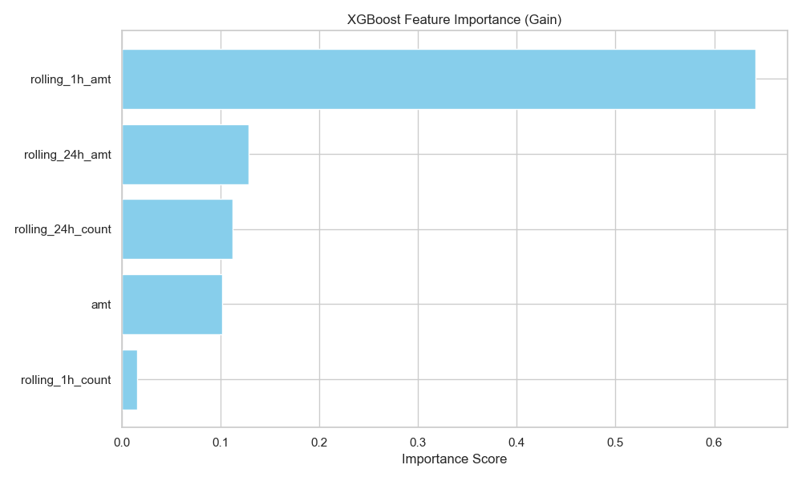
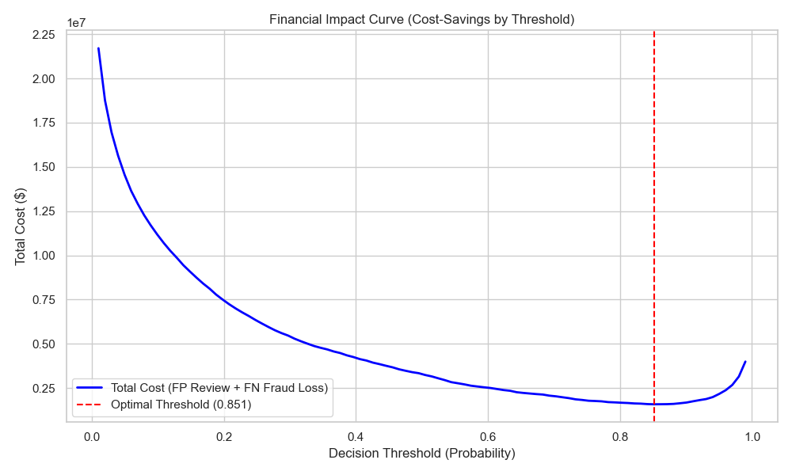
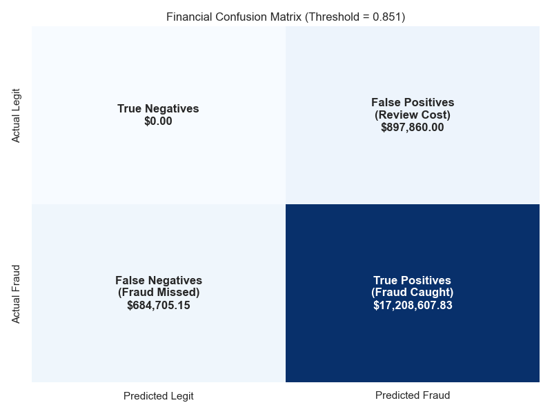
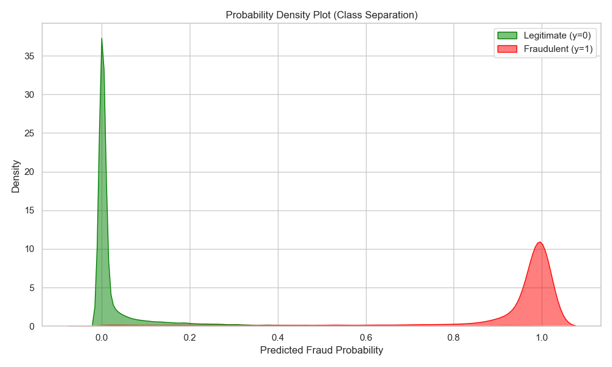

# Real-Time Credit Card Fraud Detection Pipeline

Welcome to the Credit Card Fraud Detection project! This repository contains an end-to-end, production-grade machine learning pipeline capable of processing high-velocity credit card transactions with sub-100ms latency.

## 🚀 Key Features & Innovations
- **Sub-100ms Real-Time Inference**: Powered by FastAPI and Redis.
- **Advanced Hyperparameter Optimization**: Automated tuning using Optuna.
- **Handling Class Imbalance**: Dynamic `scale_pos_weight` adjustments for XGBoost.
- **Asynchronous Event Logging**: Kafka integration for non-blocking downstream analytics.
- **Financial Value Driven**: Thresholds optimized explicitly to minimize business dollar loss, not just accuracy.
- **Live Monitoring**: Real-time terminal dashboard streaming results via Kafka.

---

## 🏗️ Architecture & Infrastructure

### 1. Offline Processing (PySpark & Optuna)
- **Data Ingestion**: PySpark reads raw customer and transaction CSVs.
- **Feature Engineering**: Calculates temporal velocity features (sliding window aggregations like `rolling_1h_count` and `rolling_24h_amt`) based on UNIX timestamps.
- **Optimization**: PyArrow is utilized for extremely fast vectorized data conversion between the JVM and Python memory.
- **Model Training**: Optuna executes multiple trials to find the best hyperparameters (`max_depth`, `learning_rate`, `n_estimators`) maximizing the PR-AUC score.
- **Feature Store Hydration**: The latest known state for every credit card is saved into **Redis** as a hash for fast lookups.

### 2. Online Inference (FastAPI & Redis)
- **Feature Lookup**: The FastAPI server receives a transaction, extracts the `cc_num`, and hits Redis for O(1) retrieval of the customer's baseline profile.
- **Decision Engine**: An XGBoost model evaluates the constructed features and outputs a fraud probability.
- **Dynamic Threshold**: The decision threshold is loaded from a `.env` file (`FRAUD_DECISION_THRESHOLD`), decoupling business logic from code.
- **Async Logging**: The transaction payload, decision, and latency are pushed to a **Kafka** topic (`scored-decisions`) so downstream services can consume them asynchronously.

---

## 📂 Project Structure
```text
.
├── api/
│   └── main.py                 # FastAPI application and inference engine
├── data/                       # Raw datasets (excluded from git)
├── docs/
│   ├── assets/                 # Evaluation charts and diagrams
│   └── report.md               # Markdown report
├── ml/
│   ├── models/                 # Serialized XGBoost model artifacts
│   ├── evaluate_model.py       # Financial evaluation and visualization generation
│   └── offline_processing.py   # PySpark training pipeline and Optuna tuning
├── scripts/
│   └── print_columns.py        # Utility script to inspect datasets
└── simulation/
    ├── dashboard.py            # Rich terminal dashboard consuming Kafka stream
    └── simulate_traffic.py     # Asynchronous load testing script
```

---

## 📈 Model Performance & Visualizations

During the data profiling phase, we discovered that geographic distance (`distance_km`) was utterly uninformative (0.00% importance) because synthetic fraudsters transacted at identical distances to legitimate customers. We dropped the feature entirely to save compute cycles during inference.

Instead, the model's decisions are heavily driven by **temporal velocity**:



### The Financial Matrix
Fraud detection is imbalanced—missed fraud costs significantly more than a false alarm. By evaluating the model against an assumed $10 operational cost per manual review, we identified the optimal decision threshold that minimizes total dollar loss:




The model also demonstrates excellent class separation:


---

## 💻 Setup & Installation

### Prerequisites
- Python 3.10+
- Java 8+ (for PySpark)
- Docker & Docker Compose (for Kafka and Redis)

### Installation
1. Clone the repository and create a virtual environment:
   ```bash
   python -m venv venv
   source venv/bin/activate
   ```
2. Install the required dependencies:
   ```bash
   pip install -r requirements.txt
   ```
3. Spin up the infrastructure (Redis, Kafka, Zookeeper) using Docker:
   ```bash
   docker-compose up -d
   ```
4. Configure the environment variables by creating a `.env` file:
   ```env
   FRAUD_DECISION_THRESHOLD=0.0731
   ```

---

## 🚦 Running the Pipeline

### 1. Train the Model & Hydrate Redis
Run the offline PySpark processing job. This will engineer features, run Optuna, train the final XGBoost model, and hydrate the Redis cache.
```bash
python ml/offline_processing.py
```

### 2. Generate Evaluation Reports
Generate the financial impact charts and feature importance metrics.
```bash
python ml/evaluate_model.py
```

### 3. Start the Real-Time Inference API
Start the FastAPI server. It will automatically connect to Redis and load the XGBoost model.
```bash
uvicorn api.main:app --reload
```

### 4. Start the Live Monitoring Dashboard
In a new terminal, launch the Kafka consumer dashboard to watch real-time metrics.
```bash
python simulation/dashboard.py
```

### 5. Blast the Traffic
In a final terminal, run the asynchronous load simulation to fire thousands of transactions at the API.
```bash
python simulation/simulate_traffic.py
```

---

## 🔮 Future Roadmap
- **Kafka Streams / Flink**: Replace the static Redis hydration with a continuous stream processor to update rolling windows natively in real-time.
- **Model Registry**: Integrate MLflow to version and track XGBoost artifacts and Optuna study histories over time.
- **Containerized Deployment**: Dockerize the FastAPI server and push it to a Kubernetes cluster for auto-scaling during traffic spikes.
